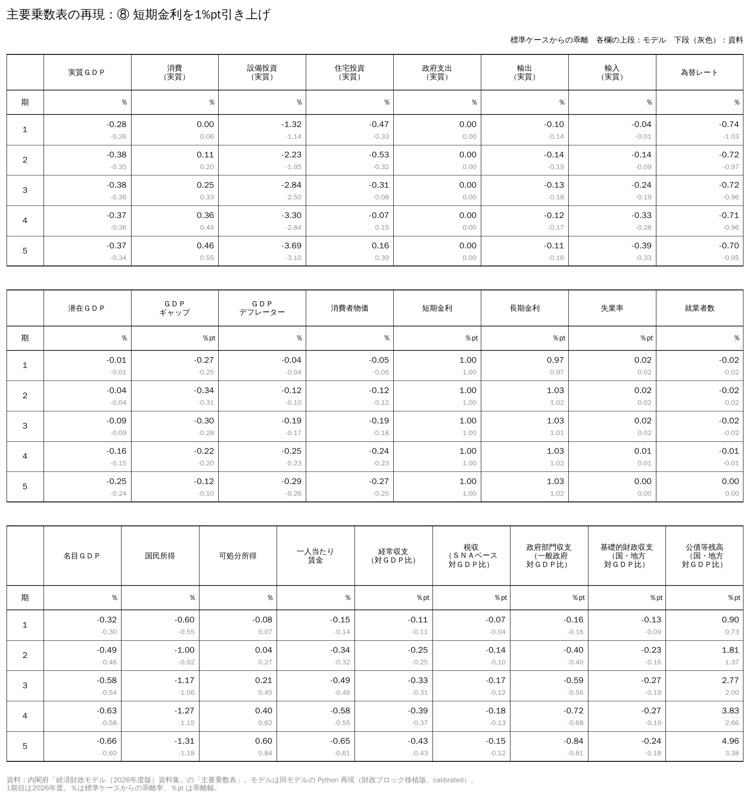
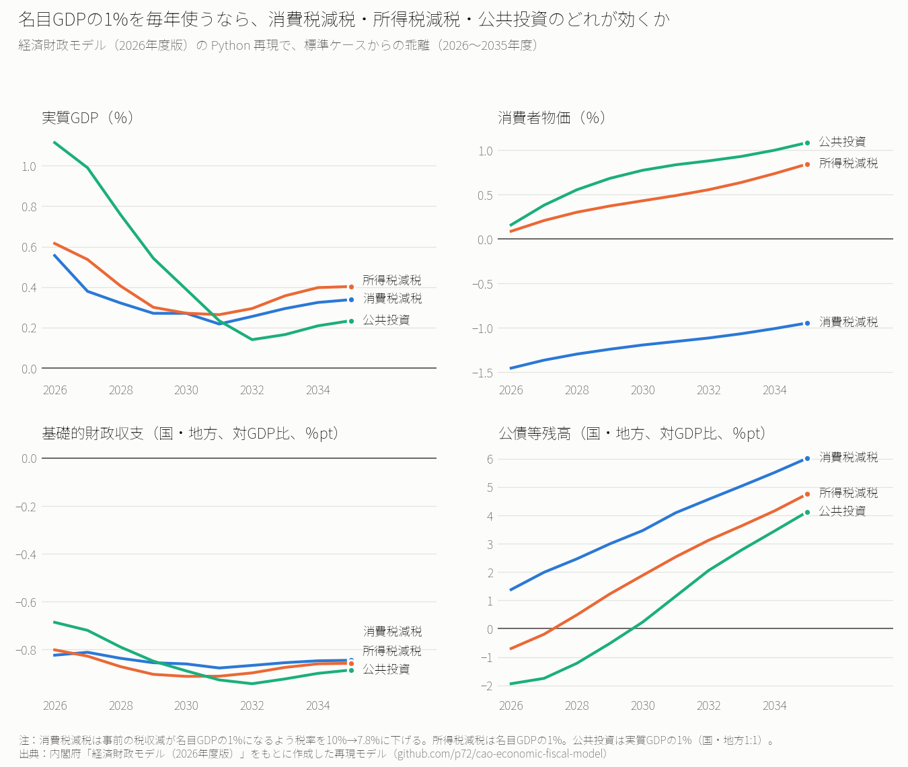
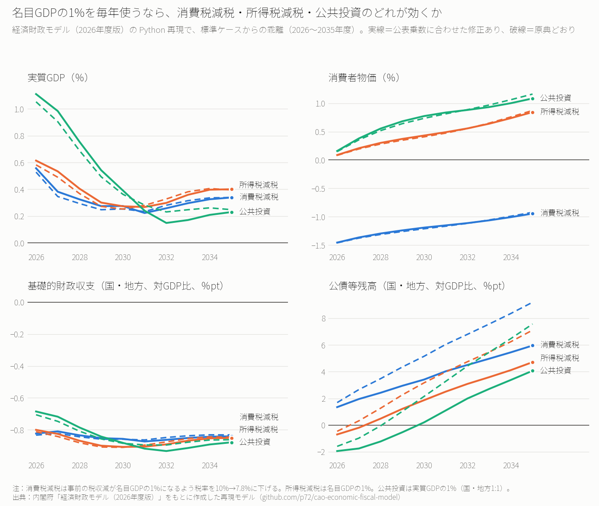
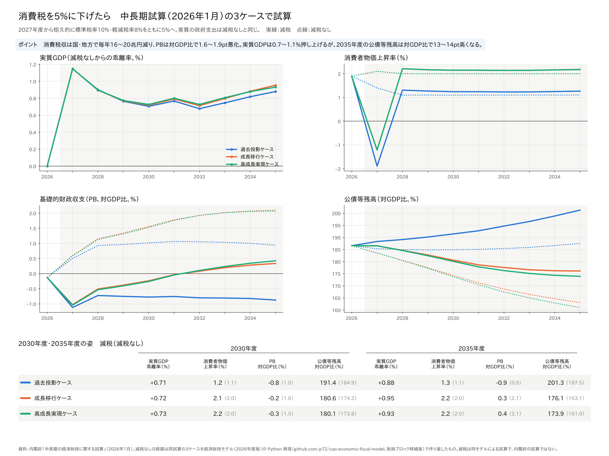
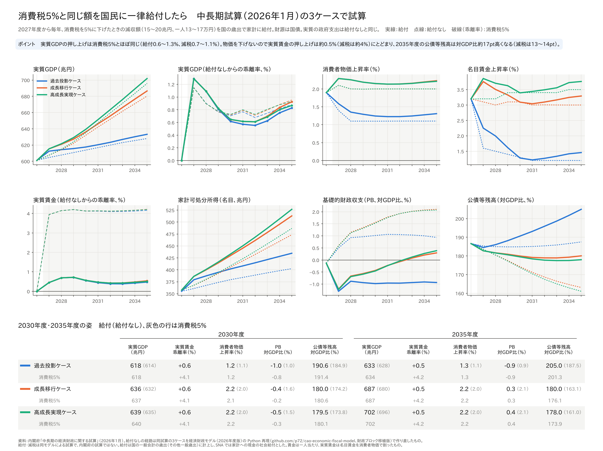
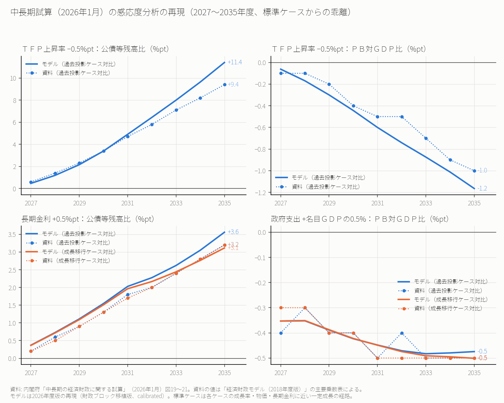
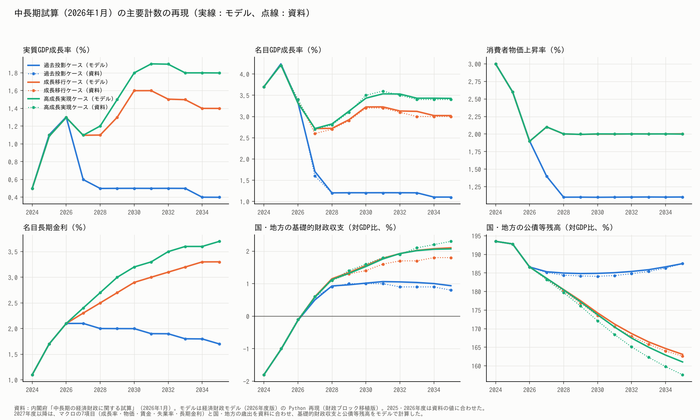

# cao-ef-model：内閣府「経済財政モデル（2026年度版）」の Python 再現

> ## 👋 はじめての方へ（まずここを読んでください）
>
> 内閣府が「中長期の経済財政に関する試算」に使っている計量モデル「経済財政モデル（2026年度版）」を、公表資料から Python で組み立て直したものです。減税・公共投資・金利上昇などが、GDP・物価・財政収支・国の借金（公債等残高）にどう効くかを計算できます。
>
> ### いちばん簡単な使い方：AI に頼む
>
> パソコンの中でコードを実行できる AI（[Claude Code](https://claude.com/claude-code) など）に、次の文をそのまま貼り付けてください。
>
> ```text
> https://github.com/p72/cao-economic-fiscal-model を手元にダウンロードして、
> README の「はじめての方へ」のとおりに動かしてください。
> 終わったら output/chuuchouki_sensitivity.png を見せて、何が分かるか説明してください。
> ```
>
> - ChatGPT や Claude のチャット画面のように、**コードを実行できない AI では計算できません**（コードの説明はできます）。
> - Python が入っていない場合は、AI に「Python を入れるところから手伝って」と頼めば案内してくれます。
>
> ### パソコンに何も入れずに、クラウドの環境で動かす
>
> 最近の AI には、GitHub のリポジトリをクラウド上の Linux 環境に取り込んで、そこで Python を実行するものがあります。パソコンに Python を入れる必要はありません。ただし、**初期設定では内閣府のサイトにつながらない**ので、最初に1か所だけ設定を変えてください。このモデルは実行中に、次の2つのサイトから資料とデータをダウンロードします。
>
> - `www5.cao.go.jp`（経済財政モデルの資料集 PDF）
> - `www.esri.cao.go.jp`（国民経済計算の Excel ファイル）
>
> **Claude Code on the web（ https://claude.ai/code 、Pro・Max・Team などの有料プラン）**
>
> 1. GitHub アカウントをつないで、このリポジトリ（または自分のアカウントにコピー（fork）したもの）を選ぶ。
> 2. 環境（Environment）の設定で **Network access** を **Custom** にし、**Allowed domains** に上の2つを1行ずつ書き、「Also include default list of common package managers」にチェックを入れる（**Full** にしてもよい）。初期設定の **Trusted** のままだと、資料のダウンロードで止まる。
> 3. 上の「AI に頼む」の文をそのまま送る。
>
> **ChatGPT の Codex（クラウド）**
>
> 1. このリポジトリ（または fork したもの）で環境を作る。
> 2. 環境の **Setup script** に次の1行を書く。セットアップスクリプトはインターネットにつながるので、ここでパッケージと資料・データのダウンロードを済ませる（作業中のインターネット接続は初期設定でオフ）。
>
> ```bash
> pip install -r requirements.txt && python src/fetch_paper.py && python src/fetch_sna.py
> ```
>
> 3. 「`python run_all.py` を実行して、終わったら output/chuuchouki_sensitivity.png の結果を説明して」と頼む。
>
> **チャット画面で Python を実行する機能（ChatGPT のデータ分析、Claude のコード実行など）**
>
> チャットの中で Python を動かせる機能もありますが、このモデルにはおすすめしません。外部のサイトにつながらないことが多く、資料とデータのダウンロードで止まります。1回の実行時間の上限がある場合は、`python run_all.py --next` で1単位（長くて70秒程度）ずつ進められますが、ダウンロードができない環境では動きません。
>
> クラウドの環境の仕様（つながるサイト、使えるプラン）は変わることがあります。うまくいかないときは、AI に「どこで止まったか」を聞いて、エラーの内容を確かめてください。
>
> ### 自分で動かす場合（3ステップ）
>
> 1. **Python 3.11 以上**を入れる（ https://www.python.org/downloads/ ）。
> 2. このリポジトリをダウンロードする。GitHub の緑の「Code」ボタン →「Download ZIP」で展開するか、`git clone https://github.com/p72/cao-economic-fiscal-model.git`。
> 3. ダウンロードしたフォルダでターミナル（Windows は PowerShell）を開き、次の2行を実行する（Windows では `python` の代わりに `py` でもよい）。
>
> ```bash
> python -m pip install -r requirements.txt
> python run_all.py
> ```
>
> - インターネットに接続した状態で実行してください。内閣府のサイトから資料集の PDF と国民経済計算の表を自動でダウンロードします（API キーや登録は不要）。
> - 時間は15〜20分ほどです。途中で止まったら、同じコマンドをもう一度実行すれば続きから進みます。
> - 結果は `output/` フォルダにできます。
>   - `output/multipliers_port.csv`：公表乗数表（8ケース×5年）と再現モデルの比較
>   - `output/multipliers_table_port_case1.png`〜`case8.png`、`output/multipliers_table_port.xlsx`：資料集と同じ体裁の主要乗数表（各欄の上段がモデル、下段が公表値）
>   - `output/chuuchouki_sensitivity.png`：中長期試算（2026年1月）の感応度分析の再現（図）
> - README のすべての図表（4通りの乗数表、減税・公共投資のシナリオの図など）を作るには `python run_all.py --all`（40〜60分）。
>
> ### 注意
>
> - 公式のモデルではありません。公表資料から再現したもので、公表値とのずれや、資料に値がなく推定した部分があります（下の「結果」「参照資料」の節）。
> - 内閣府が資料集を改訂すると、ダウンロード先の URL が変わって取得できなくなることがあります。

---

内閣府「経済財政モデル（2026年度版）」を Python で再現する試み。

- 原典：内閣府 計量分析室「計量経済モデル及び試算関係資料」 https://www5.cao.go.jp/keizai3/econome.html
- 資料集（概要・乗数、方程式リスト、変数リスト）はリポジトリには含めず、`python src/fetch_paper.py` で `reference/` に取得する。

## 規模（方程式リスト「方程式数」より）

| ブロック | 方程式 | うち推計式 | 外生変数 |
|---|---:|---:|---:|
| 人口構造・労働供給 | 84 | 0 | 389 |
| マクロ経済 | 291 | 31 | 105 |
| 財政（国債・地方債 1,293、その他 418） | 1,711 | 15 | 550 |
| 社会保障（年金 83、医療 465、介護 609、その他 10） | 1,167 | 4 | 492 |
| 合計 | 3,253 | 50 | 1,536 |

このほか、外生変数としてダミー変数、タイムトレンド、実績値の変数がある。

## 再現の範囲と作り方

マクロ経済・人口ブロックは方程式リストの式をそのまま使う。財政・社会保障ブロックは2通りある（`--fiscal`）。

- **移植版**（`--fiscal port`）：財政・社会保障ブロックも方程式リストの式を使う（国債・地方債の発行年度別の積み上げ、年金・医療・介護の制度別の式を含む）。原典にいちばん近い版で、`run_all.py` の主な結果はこの版。詳細は「財政ブロックの移植版」の節。
- **簡略版**（`--fiscal simple`、既定）：マクロブロックが参照する変数だけを簡略な式で与える。最初に作った版で、下の「方程式リストから変えたところ」「結果：公表乗数表との比較」の表はこの版。

以下は簡略版の作り方。

- **マクロ経済・人口ブロック**：方程式リストの式を自動で Python の関数に変換する（`src/translate.py`）。人口ブロックの年齢・性別のひな形は12区分×男女に展開する。年齢・男女別の労働時間のウエイトは使わない（1 と置く）。
- **財政・社会保障の簡略版**（`src/spec.py` の `FISCAL`）：マクロブロックが参照する変数だけを簡略な式で与える。
  - 税収：消費税は原典と同じ課税ベース（軽減税率は使わない）。所得税は原典の所得税の推計式の弾性値、個人住民税は原典の住民税（所得割）の推計式を使う。法人課税は法人税課税標準×実効税率とする。
  - 歳出：社会保障基金以外の政府消費と公共投資は実質額を外生で与える。医療・介護は前年の賃金・物価で、年金などの現金給付は前年の物価で伸ばす。
  - 公債等残高：政府部門収支の累積で計算する。法人課税の増減は1年遅れて効く。利払費は平均調達金利×前年度末残高で、平均調達金利は新発10年債利回りに徐々に近づく。
- **ベースライン**（`src/baseline.py`）：2024年度の国民経済計算・労働力調査の値から、実質0.5%・物価2%で伸びる定常的な経路を作り、各式のアドファクターで式をちょうど成り立たせる（GDPギャップはゼロ）。
- **ソルバー**（`src/solver.py`）：Gauss-Seidel ＋ 各式の対象変数についての1変数ニュートン法。同時に解く必要があるのは251本のブロック1つ。

## 実行手順

`python run_all.py` が以下を順に実行する（上の「はじめての方へ」）。`--next` で1単位ずつ、`--list` で一覧と進み具合。個別に実行する場合：

```bash
py src/fetch_paper.py          # 資料集PDFの取得とテキスト化
py src/parse_equations.py      # 方程式リストの構造化
py src/fetch_sna.py            # 国民経済計算 2024年度年次推計（ESRI のサイトから直接取得）
py src/fetch_lfs.py            # 労働力調査（data/raw/lfs_fy.csv を同梱しているので通常は不要。ESTAT_API_SKILL を指定）
py src/published.py            # 公表乗数表の読み取り
py src/baseline.py             # ベースライン（--mode faithful で原典どおり、--fiscal port で移植版）
py src/simulate.py             # 8ケースの乗数 → output/multipliers.csv（faithful は _faithful、移植版は _port が付く）
py src/plot_multipliers.py     # 資料集と同じ体裁の主要乗数表 → output/multipliers_table_port_case{1..8}.png、multipliers_table_port.xlsx（--fiscal simple で簡略版）
py src/scenario.py             # シナリオ → output/scenario_fiscal.csv（faithful は scenario_fiscal_faithful.csv）
py src/plot_scenario.py        # 図（--compare で2つのモードを重ねた図）
py src/baseline.py --fiscal port --variant kako     # 中長期試算の過去投影ケースに近い標準ケース（seicho も）
py src/chuuchouki.py           # 中長期試算の感応度分析 → output/chuuchouki_sensitivity.csv
py src/plot_chuuchouki.py      # その図
```

## 2つのモード（`--mode`）

| | `calibrated`（既定） | `faithful` |
|---|---|---|
| コールレートの式 | `0.246378*d(M_TAYLOR)` の項を外す | 原典どおり |
| 地方の収支のうち地方債に回る割合 `Z_LGBTH$` | 0.25 | 1（すべて） |
| 法人課税のうち翌年度に効く割合 `Z_TYCVLAG$` | 0.5 | 0（すべてその年） |

`faithful` は、公表乗数に合わせて選んだ修正を入れない。利払費の半年ずれ（原典の利払費の式と同じ形）、実質政府支出を一定にすること（公表資料の前提）、企業所得の定義（統計の対応づけ）は両方のモードで共通。

公表乗数とのずれ（8ケース×5年の二乗平均、%pt）：

| 変数 | calibrated | faithful |
|---|---:|---:|
| 実質GDP | 0.059 | 0.073 |
| 消費者物価 | 0.031 | 0.037 |
| コールレート（⑧を除く） | 0.026 | 0.076 |
| 基礎的財政収支 | 0.112 | 0.106 |
| 可処分所得 | 0.145 | 0.124 |
| 公債等残高比 | 0.248 | 0.881 |

（簡略版での値。移植版を含む4通りの比較は「財政ブロックの移植版」の節）

## 結果：公表乗数表との比較

簡略版・calibrated の値（`output/multipliers.csv`）。移植版の値は `output/multipliers_port.csv`。

### 実質GDP（標準ケースからの乖離率、％）

| ケース | 1年目 モデル | 1年目 公表 | 3年目 モデル | 3年目 公表 | 5年目 モデル | 5年目 公表 |
|---|---:|---:|---:|---:|---:|---:|
| ① 実質政府支出 GDP比1%（1年だけ） | 1.05 | 1.08 | -0.21 | -0.20 | -0.13 | -0.14 |
| ② 実質政府支出 GDP比1%（継続） | 1.05 | 1.08 | 0.72 | 0.75 | 0.38 | 0.41 |
| ③ 法人税 GDP比1%増税 | -0.21 | -0.24 | -0.38 | -0.45 | -0.38 | -0.47 |
| ④ 個人所得税 GDP比1%増税 | -0.61 | -0.64 | -0.37 | -0.43 | -0.22 | -0.29 |
| ⑤ 消費税率 1%pt引き上げ | -0.25 | -0.27 | -0.13 | -0.17 | -0.11 | -0.14 |
| ⑥ TFP上昇率 1%pt引き上げ | 0.54 | 0.54 | 2.31 | 2.26 | 4.74 | 4.60 |
| ⑦ 原油価格 20%引き上げ | -0.26 | -0.23 | -0.33 | -0.20 | -0.27 | -0.16 |
| ⑧ 短期金利 1%pt引き上げ | -0.26 | -0.26 | -0.35 | -0.36 | -0.33 | -0.34 |

### 短期金利（コールレート、乖離幅、％pt）

| ケース | 1年目 モデル | 1年目 公表 | 3年目 モデル | 3年目 公表 | 5年目 モデル | 5年目 公表 |
|---|---:|---:|---:|---:|---:|---:|
| ① 実質政府支出 GDP比1%（1年だけ） | 0.05 | 0.08 | 0.14 | 0.13 | 0.08 | 0.07 |
| ② 実質政府支出 GDP比1%（継続） | 0.05 | 0.08 | 0.33 | 0.32 | 0.51 | 0.54 |
| ③ 法人税 GDP比1%増税 | -0.01 | -0.02 | -0.09 | -0.11 | -0.19 | -0.23 |
| ④ 個人所得税 GDP比1%増税 | -0.03 | -0.05 | -0.19 | -0.19 | -0.28 | -0.32 |
| ⑤ 消費税率 1%pt引き上げ | -0.01 | -0.02 | -0.07 | -0.07 | -0.10 | -0.13 |
| ⑥ TFP上昇率 1%pt引き上げ | -0.01 | -0.01 | -0.06 | -0.06 | -0.04 | -0.08 |
| ⑦ 原油価格 20%引き上げ | -0.00 | 0.00 | -0.07 | -0.05 | -0.16 | -0.11 |

### 公債等残高（国・地方、対GDP比の乖離幅、％pt）

| ケース | 1年目 モデル | 1年目 公表 | 3年目 モデル | 3年目 公表 | 5年目 モデル | 5年目 公表 |
|---|---:|---:|---:|---:|---:|---:|
| ① 実質政府支出 GDP比1%（1年だけ） | -1.93 | -1.89 | 0.52 | 0.45 | 0.76 | 0.67 |
| ② 実質政府支出 GDP比1%（継続） | -1.93 | -1.89 | -1.24 | -1.17 | 0.16 | 0.26 |
| ③ 法人税 GDP比1%増税 | 0.25 | -0.03 | -0.44 | -0.08 | -1.45 | -0.62 |
| ④ 個人所得税 GDP比1%増税 | 0.71 | 0.75 | -0.44 | -0.47 | -1.73 | -1.97 |
| ⑤ 消費税率 1%pt引き上げ | -0.65 | -0.55 | -1.14 | -1.03 | -1.56 | -1.52 |
| ⑥ TFP上昇率 1%pt引き上げ | -0.88 | -0.86 | -3.64 | -3.47 | -7.62 | -7.03 |
| ⑦ 原油価格 20%引き上げ | 0.76 | 0.71 | 1.41 | 1.19 | 1.87 | 1.42 |
| ⑧ 短期金利 1%pt引き上げ | 0.66 | 0.73 | 1.83 | 2.00 | 3.20 | 3.38 |

全変数・全期間の比較は `output/multipliers.csv`（列 `model` と `published`）。

資料集と同じ体裁の主要乗数表（3つの表×8ケース、各欄の上段がモデル、下段が公表値）は `src/plot_multipliers.py` で作る。移植版・calibrated の例（短期金利1%pt引き上げ）：



### 方程式リストから変えたところ（`src/spec.py` の `EQ_FIX`、`FISCAL`）

1. **コールレートの式から `0.246378*d(M_TAYLOR)` の項を外した。** 原典の式どおりだと、テイラー・ルールの今期の変化にすぐ反応し、政府支出拡大の1年目のコールレートの上昇が0.24%ptと公表乗数（0.08%pt）の3倍になる。この項を外すと、ショックを外から与える⑧を除く7ケース×5年で、乗数の公表値とのずれ（二乗平均）がコールレートで0.076→0.031%pt、長期金利で0.079→0.029%ptに縮み、設備投資・実質GDPも公表値に近づく。係数を0〜0.05にすると公表値と最もよく合い、この項を1期遅らせても合わない。公表乗数の計算ではこの項が実質的に効いていないとみて外した。
2. **利払費を半年ずらした。** 原典の国債利払費の式（`Z_PINTBON=0.5*B_BRPAY+0.5*B_BRPAY(-1)`）と同じく、平均調達金利の今年度分と前年度分の平均を使う。金利ケース⑧の1年目の一般政府の収支（モデル−0.17、公表−0.16）と家計の可処分所得（0.09、0.07）がほぼ公表値どおりになった。

3. **地方債の残高は、地方の収支の変化の一部（`Z_LGBTH$`=0.25）だけで増減させた。** 原典は地方債残高を発行額−償還額で積み上げ（`B_ZLGB=B_ZLGB(-1)+Z_LGB-B_ROPT`）、発行額は地方財政計画で決まる。地方の収支の変化をそのまま地方債の増減にすると、増税ケースで残高の減り方が公表値の1.5倍になる。割合を 0, 0.25, 0.5, 0.75 で比べ、公表乗数に最もよく合う0.25とした（残りは基金などの金融資産の増減とみなす）。
4. **法人課税の増減の半分（`Z_TYCVLAG$`=0.5）は、会計ベースの残高に1年遅れて効くようにした。** 法人税は中間納付で約半分を当年度に納め、残りを決算後に納める（SNA は発生主義）。0, 0.5, 1 で比べ、0.5が最もよく合う。

3と4で、公債等残高比の乗数の公表値とのずれ（8ケース×5年の二乗平均）は0.649→0.318%ptに縮んだ。

5. **社会保障基金の現物給付（医療・介護）も実質額を外生にした。** 公表資料は「ケース③〜⑧では実質政府支出は一定と仮定」している。名目額で伸ばしていたため、物価が動くと実質の政府支出が変わっていた（原油ケースで−0.19%）。直したことで、実質GDPの乗数のずれは0.086→0.061%pt、公債等残高比は0.318→0.265%ptに縮んだ。

6. **企業所得（法人企業の分配所得受払前）`M_YCVPRE` に、分配表の参考行「法人企業所得（法人企業の分配所得、海外直接投資に関する再投資収益支払前）」を使った**（`src/data2024.py`）。配当受取 `M_YCVDIV` は原典の定義式 `M_YCVPRE=M_YCVPOST+M_YCVDIV` から逆算する（21.0兆円）。最初は一般政府・家計・非営利団体の配当受取の合計（13.7兆円）を使っていたため、配当を除く財産所得 `M_YIVR`（長期金利1%ptで約10%増える）が大きく、金利ケースの可処分所得の増え方が公表乗数の1.4倍になっていた。直したことで、金利ケースの5年目の可処分所得は1.17→0.88%（公表0.84%）、消費は0.65→0.56%（公表0.55%）、実質GDPは−0.25→−0.30%（公表−0.34%）になった。

### 公表値と差が残るところ

- **消費税率のケース（⑤）**：モデルのほうが実質GDPの落ち込みが毎年0.02〜0.04%pt浅い。1年目は消費者物価の上がり方が小さいことが主な原因で、原典の式にある軽減税率の項（`Z_RTCIV2`、`Z_RTCIV2$`）を使い、民間消費の課税ベースの2割を軽減税率対象とし、標準税率と軽減税率をともに1%pt引き上げるようにした（`src/data2024.py`、`src/simulate.py`。2割は軽減税率による減収 約1兆円を2%ptの税率差で割った課税ベース 約59兆円から）。消費者物価の1年目は +0.67→+0.70%（公表 +0.74%）、実質GDPは −0.23→−0.25%（公表 −0.27%）になった。3年目以降は、モデルの設備投資が金利の低下（資本コストの低下）で4年目にプラスに戻るのに対し、公表値は5年目も −0.11% で、差の半分ほどを占める。
- **原油価格のケース（⑦）**：名目GDPは公表値とほぼ一致する（3年目 モデル −0.51%、公表 −0.49%）。実質GDPの差（3年目 −0.32%、公表 −0.20%）はすべてGDPデフレーターの差で、下の「公表乗数表の実質GDPと需要項目の食い違い」のとおり、公表値の実質GDPが需要項目の合計と合っていないことによる。

- **公債等残高比のTFP・法人税・金利のケース**：TFPケースは残高の減り方が公表値より大きい（5年目−7.6、公表−7.0）。法人税ケースは1年目に公表値ほど減らず、5年目には大きく減る（−1.45、公表−0.62）。金利ケースは増え方が公表値より小さい（5年目3.2、公表3.4）。原典は会計ベースの歳入・歳出から公債発行額を決めるので、SNAベースの収支の累積で近似した分の差が残る。
- **公表乗数表の実質GDPと需要項目の食い違い**：公表乗数表の実質GDPは、同じ表の需要項目（消費・設備投資・住宅・政府支出・輸出入）を2026年度の名目の構成比で足し上げた値と食い違っている（実質GDP−需要項目の合計が、1・3・5年目に原油で0.00／+0.11／+0.13、TFPで+0.04／+0.07／+0.12、金利で−0.04／−0.07／−0.11、公共投資で−0.07%pt前後。ほかのケースはほぼ0）。表にない在庫変動か集計の仕方によるとみられる。モデルの実質GDPは需要項目の合計と一致する。原油ケースは、需要項目の合計で比べるとモデルと公表値はほぼ一致する（モデル−0.26／−0.32／−0.27、公表−0.23／−0.31／−0.29）。金利ケースは逆に、実質GDPで比べると一致し（モデル−0.26／−0.35／−0.33、公表−0.26／−0.36／−0.34）、需要項目の合計では公表値より下がり方が大きい（公表−0.22／−0.29／−0.23）。
- **為替レートの反応**：為替の式は円/ドルの水準の式（金利差1%pt＝1円）なので、反応の大きさ（%）は標準ケースの為替水準で決まる。2024年度平均の152.6円では、金利ケースの円高が−0.73%（公表−1.03%）と小さい。標準ケースを114円にすると全ケースの為替・輸出の乗数が公表値とほぼ一致するが、根拠がないので変えていない。

## 財政ブロックの移植版（`--fiscal port`）

`--fiscal simple`（既定）は財政・社会保障を簡略版で置き換える。`--fiscal port` は財政ブロックの会計部分を方程式リストどおりに移植する（`src/fiscal_port.py`、`src/data_fiscal.py`）。

- **移植した部分（約250本）**：国の一般会計（歳入・歳出）、公共事業関係特別会計、地方財政計画、交付税特会、地方普通会計（決算）、その他指標。マクロブロックのうち簡略版で置き換えていた29本（政府消費・社会給付・税収のSNA換算など）も原典どおりに戻す。
- **資料の誤り・欠落を補った式**（`PATCH`）：地方歳出（計画値）`ZP_LGEXTOTAL` は資料に式がないので、基準財政需要額の対象経費と水準超経費の合計と推定した。`Z_GREXPXW`（賃金による伸び率）と `Z_TXBREF`（法人税の参照値）は資料に定義がないので推定した。ほか括弧の誤植3本を直した。
- **国債・地方債**（`src/bond_port.py`）：普通国債は方程式リストのひな形どおり、2026〜2035年度の発行分を発行年度×年限（1・2・3・5・10・20・30・40年）ごとに残高・償還額・発行時の利率・利払費で積み上げ、イールドカーブ・超長期債の上乗せ・額面発行比率・発行必要額（`Z_GOVDFC`）の式もそのまま使う。原典と同じく、既発債（2025年度末に残っている557銘柄）の年度別の残高・償還額・利払費は外生で与え、財務省の銘柄別現在高と入札結果（表面利率）から作る（`src/jgb_data.py`）。発行の年限構成は2025年度の入札の落札額。地方債と臨時財政対策債も、2026年度以降の発行分を経過年数（0〜20年）ごとに20年元利均等償還（据置2年）で積み上げ、既発分の元金償還・利払費は外生で与える。既発の地方債の償還予定は統計がないので、2025年度末残高を平均14年で償還すると置いた。標準ケースでは、この部分だけをほかの変数を固定して2025年度から前向きに解き、発行年度別の残高を現実の発行・償還に合わせる（合成の一定成長の経路のままだと、金利が動いたときの利払費の増え方が正しく出ない）。方程式リストの残高・償還額・利払費の合計式は令和7年度以降の発行分だけを並べているが、既発債も変数リストにあり普通国債残高に含まれるので、合計に加えた。年金特例国債は集約した式、復興債・GX経済移行債・半導体・AI債は外生のまま。
- **社会保障ブロック**：年金（83本）は方程式リストの式をそのまま使う（行の折り返しで読み取れない4本は注記の続きをつないで復元、`PENSION_PATCH`）。医療（101本）・介護（39本）は、制度区分（協会けんぽ・共済・その他被用者・市町村国保・国保組合・後期高齢者）ごとの給付・前期高齢者の財政調整・後期高齢者支援金・公費負担・保険料の式を原典どおりに使い、年齢別・要介護度別・サービス別の積み上げだけを「基準年度の給付費 × 費用の指数（報酬改定率で伸びる）」に集約した（`SS_COLLAPSED`）。乗数のショックでは人口・加入者数・認定率は変わらず、どの区分の一人当たり費用も同じ改定率で伸びるので、集約しても給付費の動きは積み上げと一致する。雇用保険・社会扶助（その他10本）も原典の式を使う（雇用保険料の式 `log(S_OUIIPRM)=0.949266*log(S_OUIIPRM$+M_W+M_LW)` は単位の違う量の和になるので、積の誤植と判断した）。
- **データ**：2024年度の国の一般会計の決算（税目別歳入、主要経費別歳出、国債費の内訳）、地方財政計画、地方の普通会計決算から取った。地方の性質別経費の社会保障・教育分は、地方財政白書（令和8年版）の目的別×性質別の内訳（民生費・衛生費・教育費の人件費・物件費・扶助費・補助費等・繰出金・普通建設事業費、第9表の補助費等・繰出金）から取った。民生費の扶助費は CSV の値（18,905億円）が桁落ちしているので、民生費の総額と構成比55.3%から180,904億円とした。年金・医療・介護・雇用保険の制度別の金額・人数・負担割合は、公的年金財政状況報告（令和6年度）、医療保険に関する基礎資料（令和5年度）の財政構造表、介護保険事業状況報告（令和6年度）、労働保険特別会計の決算から取り、負担割合は実額から計算した（出典の一覧は `data/raw/ss_stats_sources.md`）。
- **シミュレーション**：公表乗数の前提に合わせ、実質の政府消費と公的固定資本形成を一定（政府支出のケースでは標準ケース＋実質GDPの1%）に保つよう、歳出項目の調整項を毎年合わせ直す。

公表乗数とのずれ（8ケース×5年の二乗平均、%pt、`faithful` で比較）：

| 変数 | 簡略版 | 移植版 |
|---|---:|---:|
| 実質GDP | 0.073 | 0.073 |
| 消費者物価 | 0.037 | 0.035 |
| コールレート（⑧を除く） | 0.076 | 0.082 |
| 可処分所得 | 0.124 | 0.166 |
| 基礎的財政収支 | 0.106 | 0.109 |
| 公債等残高比 | 0.881 | 1.143 |

第2段階（B2）で直したこと：
- 年金積立金の運用収入（社会保障の簡略版）は、平均利回りが国債と同じくゆっくり市場金利に近づく形にした（第3段階で原典の式に置き換えた。原典ではインカムゲインの利回りは外生）。その年の長期金利をそのまま掛けていたため、金利上昇で社会保障基金の利子収入が1年目に4割増え、可処分所得が逆に減っていた。
- SNA の年金給付 `M_BSSVPEN` を負値（政府の支払い）で入れた。原典の式（`M_BSSVF=((-M_BSSVPEN)+…)*(-1)`）は負値を前提にしており、正値で入れると年金が増えたときに家計の受取が減る向きに働いていた。
- 2024年度の値で原典の式が成り立つように、水準超経費・地方債計画の比率、臨時財政対策債の既発分、財源不足額（1.8兆円）、税外収入のうち移転に当たる割合などを決めた。教育費分の人件費の外生値（`Z_LGEXPEX`）は外挿期間には使わない。
- モデル独自区分の金額（国のその他一般歳出の内訳、地方の性質別経費の社会保障・教育分、扶助費の補助・単独）を、原典の振り分けの係数のもとで SNA の一般政府の部門別勘定に合うように最小二乗法で推定した（`data_fiscal.calibrate_splits`）。国の人件費（5.3兆円）とエネルギー対策特会への繰入（電源開発促進税と同額）は固定した。

第3段階で直したこと：
- 地方の性質別経費の社会保障・教育分を、SNA に合わせた推定値から地方財政白書の目的別×性質別の内訳に置き換えた。乗数はほとんど変わらなかった（移植・calibrated で実質GDP 0.057→0.058、公債等残高比 1.191→1.204）。
- 社会保障ブロックの年金・医療・介護を原典の式にした（上記）。年金だけで可処分所得のずれが 0.165→0.136、公債等残高比が 1.204→1.169 に縮んだ。医療・介護も入れると、可処分所得は 0.153、実質GDPは 0.058→0.067 に広がった。広がったのはほぼ TFP ケース（⑥）で、原典では医療・介護の保険料が「給付費−公費負担」で決まり、給付費は報酬改定率（賃金と物価の平均）で伸びる。TFP が上がると物価が下がるので、保険料の伸びが賃金の伸びより小さくなり、可処分所得・消費が公表値より大きく伸びる（可処分所得5年目 3.13%、公表 2.55%）。簡略版は保険料を賃金に比例させていたので、たまたま近かった。

第4段階で直したこと：
- 雇用保険・社会扶助（その他10本）を原典の式にし、社会保障ブロックの値を統計に置き換えた。乗数はほとんど変わらなかった（水準ではなく伸び率が効くため）。
- 普通国債と地方債を発行年度別の積み上げにした（上記）。普通国債だけでは、金利ケース（⑧）の公債等残高比が5年目に +4.61→+5.02%pt（公表 +3.38%pt）と広がった。既発債の満期と短期債の借換えを積み上げると、金利上昇が国債費に早く波及するため。地方債も入れると、既発分の償還が残高に比例しなくなり、法人税ケース（③）の残高比のずれが縮んで（5年目 −5.07→−3.97%pt）、全体のずれは 1.167→1.022 になった。一方、地方債は固定金利の元利均等償還なので、金利上昇が地方の利払費（家計の利子受取）に波及するのが遅く、金利ケースの可処分所得が下がって可処分所得のずれは 0.149→0.171 に広がった。

### 4つの組み合わせの比較（公表乗数とのずれ、8ケース×5年の二乗平均、%pt）

| 変数 | 簡略・calibrated | 簡略・faithful | 移植・calibrated | 移植・faithful |
|---|---:|---:|---:|---:|
| 実質GDP | **0.059** | 0.073 | 0.068 | 0.073 |
| 消費者物価 | **0.031** | 0.037 | 0.032 | 0.035 |
| コールレート（⑧を除く） | 0.026 | 0.076 | **0.025** | 0.082 |
| 可処分所得 | 0.145 | **0.124** | 0.172 | 0.167 |
| 基礎的財政収支 | 0.112 | **0.106** | 0.111 | 0.108 |
| 公債等残高比 | **0.248** | 0.881 | 1.052 | 1.164 |

移植版は社会保障ブロックと国債・地方債まで原典の式にした版（第4段階）。マクロ経済の変数は簡略・calibrated と移植・calibrated がほぼ同じで、差は TFP ケースの社会保険料の動き方による（上記）。公債等残高比は簡略版・calibrated が圧倒的に近いが、これは公表値に合うように選んだ2つの値（地方債に回る割合0.25、法人課税の半分を翌年度に計上）による。

### 法人税ケースの公債等残高比について

（第3段階までの値。第4段階で地方債を積み上げにすると5年目は −3.97%pt に縮んだが、公表値との差はまだ大きい）移植版で会計の法人税（国）の実効税率を上げると、実質GDP（5年目 −0.45%、公表 −0.47%）、設備投資（−2.65%、公表 −2.47%）、税収（SNA、対GDP比 +1.30%pt、公表 +1.07%pt）、基礎的財政収支（+1.19%pt、公表 +1.00%pt）は公表値とよく合うが、公債等残高比は5年目に −5.48%pt と公表値（−0.62%pt）の約9倍下がる。原典では公債金収入が「歳出−税収−その他収入＋41条剰余金」で決まり、41条剰余金は外生変数なので、増えた税収はそのまま国債の発行を減らすはずである。公表値で基礎的財政収支が毎年1%改善しても残高がほとんど下がらない理由は、資料の範囲では説明できなかった。

### 残る課題

- 国の集合消費・個別消費と対民間移転の SNA の値は、原典の振り分けの係数のもとでは同時には満たせない（残りはアドファクターが吸収する）。
- 診療報酬・介護報酬の改定率の重み（当年度と前年度、賃金と物価）、年金の既裁定者の割合、積立金の実質利回りは資料に値がないので推定した。
- 医療・介護の年齢別・要介護度別の積み上げ（約550本）は費用の指数に集約したまま。乗数には影響しないが、人口が変わるシナリオを回すには展開が必要（5歳階級別の加入者数・一人当たり医療費・認定率・利用率のデータが要る）。
- 年金特例国債・復興債・GX経済移行債・半導体・AI債の発行年度別の積み上げは移植していない（残高は合わせて約10兆円）。
- 既発の地方債の年度別の償還予定は統計がないので推定した。
- 原典の既発債のデータ（平成11年度〜令和6年度発行分）は2024年度末時点のもの。ここでは2025年度末の銘柄別現在高を使い、2025年度発行分も既発債に含めた。

## シナリオ：同じ規模の消費税減税・所得税減税・公共投資（`src/scenario.py`、`src/plot_scenario.py`）

名目GDPの1%（約6.8兆円）を2026年度から10年間使い続けたときの、標準ケースからの乖離（簡略版）。



2つのモードの比較（実線 calibrated、破線 faithful）：



実質GDP・物価・基礎的財政収支はモードでほとんど変わらない。公債等残高比は faithful のほうが大きく上がる（10年後に消費税減税で+6.0→+9.3%pt、所得税減税で+4.8→+7.2%pt、公共投資で+4.1→+7.7%pt）。faithful では地方の収支の悪化がすべて地方債の増加になるため。

- 実質GDPは公共投資が1年目+1.1%と最も大きいが、5年目には+0.4%まで縮む。減税は+0.3〜0.6%程度。
- 消費税減税だけが物価を下げる（1年目−1.5%）。
- 10年後の公債等残高比はどれも+4〜6%pt。消費税減税は物価が下がって名目GDPが伸びない分、残高比の上昇が最も大きい（+6.0%pt）。

## シナリオ：消費税を5%に下げたら（`src/ctax5.py`、`src/plot_ctax5.py`）

2027年度から恒久的に、標準税率10%・軽減税率8%をともに5%に下げる。中長期試算（2026年1月）の3ケースの再現経路（`src/projection.py`）を減税なしの経路とし、誤差項はそのままで2027〜2035年度を解き直す。実質の政府消費・公的固定資本形成は減税なしと同じに保つ。`python src/ctax5.py --check`（減税せずに解き直す）で減税なしの経路と一致することを確認した。



- 消費税収は国・地方で毎年16〜20兆円減り、基礎的財政収支は対GDP比で1.6〜1.9%pt悪化する。
- 実質GDPは1年目+1.2%、2035年度+0.9%前後（4〜7兆円）。消費者物価は2027年度に約3%pt下がり、その後は減税なしより0.2%pt程度高い。
- 実質賃金（一人当たり賃金を消費者物価で割ったもの）は約4%高くなる。ほとんどは物価が下がる分で、名目賃金の上昇率は0.1〜0.4%pt程度高い。
- 長期金利は2035年度に+0.8%pt程度上がり、公債等残高比は2035年度に13〜14%pt高くなる（過去投影 201%、成長移行 176%、高成長実現 174%）。

## シナリオ：消費税5%と同じ額を国民に一律給付したら（`src/gift.py`、`src/plot_gift.py`）

消費税5%への減税の事前の減収額（年15〜20兆円、一人13〜17万円）を、2027年度から毎年、家計に給付する。予算では国の一般会計のその他一般歳出に計上し（財源は国債）、SNA では家計への現金の社会給付とする（政府消費などには配分しない）。実質の政府消費・公的固定資本形成は給付なしと同じに保つ。図の破線と表の灰色の行は消費税5%。



- 実質GDPの押し上げは消費税5%とほぼ同じ（1年目 給付+1.3%・減税+1.2%、2035年度はどちらも+0.9%前後）。
- 給付は物価を下げないので、実質賃金の押し上げは約0.5%（減税は約4%）。消費者物価上昇率は0.2%pt程度高くなる。
- 2035年度の公債等残高比は約17%pt高くなる（減税は13〜14%pt）。減税は物価が下がって歳出も減る分、残高の増え方が小さい。

## 再現：中長期試算（2026年1月）の感応度分析（`src/chuuchouki.py`、`src/plot_chuuchouki.py`）

内閣府「中長期の経済財政に関する試算」（2026年1月、 https://www5.cao.go.jp/keizai3/econome/r8chuuchouki2601.pdf ）の「５．リスク・不確実性」にある3つの感応度分析（図19〜21）を、財政ブロック移植版（calibrated）で計算した。資料は「経済財政モデル（2018年度版）」の主要乗数表を当てはめて作っているので、2026年度版の再現モデルで直接計算した値と比べることになる。

- ショックはいずれも2027〜2035年度：ＴＦＰ上昇率 −0.5%pt（対数ＴＦＰを毎年 −0.005 ずつ）、長期金利 +0.5%pt（新発10年国債利回りを外生化）、政府支出 +名目ＧＤＰの0.5%（政府支出ケースと同じく国・地方の消費と投資に配分）。実質政府支出はそれ以外一定。
- 標準ケースは、過去投影ケース・成長移行ケースの2027〜2035年度の平均的な姿（実質成長率 0.5%・1.4%、ＧＤＰデフレーター 0.7%・1.6%、長期金利 2.0%・3.0%）に近い一定成長の経路（`baseline.py --variant kako|seicho`）。短期金利は資料にないので、2024年度の長短金利差を保つとした。



2035年度の乖離（資料 → モデル）：

| ケース | 指標 | 資料 | モデル |
|---|---|---:|---:|
| ＴＦＰ −0.5%pt（過去投影対比） | 潜在成長率 | −0.9 | −0.78 |
| | 名目ＧＤＰ（%） | −4.1 | −3.1 |
| | ＰＢ対ＧＤＰ比 | −1.0 | −1.17 |
| | 公債等残高比 | +9.4 | +11.8 |
| 長期金利 +0.5%pt（過去投影対比） | 公債等残高比 | +3.2 | +3.6 |
| 長期金利 +0.5%pt（成長移行対比） | 公債等残高比 | +3.2 | +3.3 |
| 政府支出 +0.5%（過去投影対比） | ＰＢ対ＧＤＰ比 | −0.5 | −0.46 |
| 政府支出 +0.5%（成長移行対比） | ＰＢ対ＧＤＰ比 | −0.5 | −0.46 |

- 3つとも向きと大きさはおおむね合う。過去投影ケース対比の政府支出・金利のケースは年ごとの経路もほぼ重なる。
- ＴＦＰのケースは、モデルのほうが名目ＧＤＰの下がり方が小さい（物価の下がり方が小さい）一方、公債等残高比の上がり方が大きい。
- 資料は乗数表を2つのケースに同じように足しているので、乖離はケースによらず同じ値になる。このモデルは標準ケースの金利・成長率の水準で乖離が変わる。成長移行ケース対比の金利のケースは、名目成長率が高いぶん残高比の上がり方がやや小さい（+3.3%pt、過去投影対比は+3.6%pt）。
- 金利のケースでは2032年度から実質ＧＤＰがプラスに転じる。設備投資の式が資本コストを5年移動平均で入れているので、6年目に望ましい資本ストックの低下が止まって設備投資が戻ることと、金利上昇で家計の利子受取が増えて消費が伸び続けることによる。
- 最初の計算では、成長移行ケース対比の政府支出のケースで2034〜35年度に地方の歳出が膨らみ、ＰＢの悪化が −0.68%pt まで広がっていた。原因は標準ケースの作り方の不具合で、財政ブロックの「1＋伸び率」の変数（`Z_GREXPXA` など）を名目値と同じく毎年伸ばしていたため、式との差が誤差項に入って年々大きくなり、物価の高いケースほど歳出が雪だるま式に増えていた。伸び率・比率の変数を一定として扱うように直した（`baseline.py` の `FISCAL_RATE`）。乗数表への影響はほとんどない（実質GDPのずれ 0.068→0.069）。地方の計画年度ダミー（`Z_KEIKAKUL`）と交付税率（`Z_RKF…`）も同じく伸ばしていたので、一定にした（下の主要計数表の節）。

## 再現：中長期試算（2026年1月）の主要計数表（`src/projection.py`、`src/plot_projection.py`）

中長期試算の計数表「1.主要計数表」（資料35ページ）を、過去投影・成長移行・高成長実現の3ケースについて作り直した。



表（上段：モデル、下段：資料）：[過去投影ケース](output/chuuchouki_table_kako.png)、[成長移行ケース](output/chuuchouki_table_seicho.png)、[高成長実現ケース](output/chuuchouki_table_koseicho.png)。数値は `output/chuuchouki_projection.csv`。

資料の見た目のままの表（3ケース、モデルの値）：[output/chuuchouki_table.png](output/chuuchouki_table.png)

**方法**
- 出発点は2024年度の実績。標準ケースは実質ゼロ成長で、物価だけが各ケースのＧＤＰデフレーター（過去投影 0.7%、成長移行・高成長実現 1.6%）で伸びる経路（`baseline.py --variant proj_kako|proj_seicho`）とし、推計式の誤差項はこの経路で式が成り立つ値（中立の値）にする。
- 前提（付録1）：人口は国立社会保障・人口問題研究所「日本の将来推計人口（令和5年推計）」出生中位（死亡中位）の男女・5歳階級別人口（`src/fetch_ipss.py`）。労働参加率は2035年度に資料の値（65.7%、66.9%）になるよう男女・年齢別の労働力率を引き上げる（JILPT の推計の代わりの簡略な方法）。ＴＦＰ上昇率は過去投影 0.6%、成長移行 1.1%、高成長実現 1.4%（2030年度までに到達）。世界経済成長率 2.7%→2.5%、世界物価 1.8%→1.9%、原油 73.7ドル。
- **マクロの項目は全期間、資料に合わせる**：潜在成長率・実質ＧＤＰ成長率・消費者物価・ＧＤＰデフレーター・失業率・賃金・名目長期金利を、対応する式の誤差項で決める。短期金利は資料にないので、長期金利との差を2024年度の実績（0.87%pt）に保つ（テイラー・ルールのままだと短期金利が長期金利を上回り、超長期債の利率が低く出て利払費が小さくなる）。
- **財政は、資料の「財政の詳細計数表」（36・37ページ）の予算ベースの項目を与え、ＳＮＡベースの基礎的財政収支（ＰＢ）と公債等残高をモデルで計算する**。与える項目：国の基礎的財政収支対象経費、地方の一般歳出（歳出から公債費と積立金を除いたもの。資料の注４から逆算）、国の利払費、地方の税収、地方交付税等（いずれも全期間。国の税収は2025・2026年度だけ）。2027年度以降は国の一般会計のその他収入の2026年度からの増減も合わせる。高成長実現ケースは資料に表がないので、成長移行ケースの値を賃金上昇率の差の半分で延ばし（歳出は物価・賃金上昇率並みに伸び、物価上昇率は2つのケースで同じため）、利払費は成長移行ケースで決めた誤差項を使う。
- 2025・2026年度はＰＢ（国・地方別）と公債等残高比も資料に合わせる。2026年度の歳出は補正予算を含まない予算なので、ＳＮＡのＰＢに合わせると歳出が資料より国で11兆円多くなる（前年度までの補正予算の基金からの支出とみなす）。この差は2027年度以降、毎年3割ずつ残るとする。資料の国の表で、ＳＮＡのＰＢと予算ベースの収支（税収＋その他収入−ＰＢ対象経費）の差は2026年度 −11.7兆円、2027年度 −5.2兆円、2028年度 −3.5〜−3.8兆円で、2029年度以降は −2.4兆円前後で落ち着くので、落ち着いた値を上回る部分（基金からの支出）は2027年度に約3割、2028年度に約1割強残っている。
- 移植で見つかった不足：その他一般歳出のＳＮＡ用の変数 `Z_EXPX35E` は方程式リストに式がなく、外生のままだと国の歳出を動かしてもＳＮＡのＰＢが動かない。`Z_EXPX35E = Z_EXPX35 + Z_ADJEXPX35E` を加えた。

**結果（2035年度、モデル／資料）**
- 過去投影：名目ＧＤＰ 773.1／771.7兆円、ＰＢ 0.9／0.8、公債等残高比 187.5／187.5
- 成長移行：名目ＧＤＰ 903.6／901.7兆円、ＰＢ 2.1／1.8、公債等残高比 163.1／162.6
- 高成長実現：名目ＧＤＰ 924.3／924.5兆円、ＰＢ 2.1／2.3、公債等残高比 161.0／157.6
- 2027〜2035年度の差の最大：ＰＢは過去投影0.15%pt、成長移行0.32%pt、高成長実現0.23%pt。公債等残高比は過去投影・成長移行で0.8%pt以内、高成長実現で3.5%pt。2027年度のＰＢは3ケースとも0.1%pt以内。

**前の版からの修正（2026-10-10）**

前の版では、2027年度のＰＢが3ケースとも0.4%pt低く、成長移行ケースの2032年度以降のＰＢが0.3〜0.5%pt高かった（地方のＳＮＡの収支が2035年度に18.3兆円、資料15.4兆円）。国・地方の収支を項目ごとに分けて調べ、次の3つを直した。

1. **地方の計画年度ダミーが毎年伸びていた**：標準ケースを作るとき、`Z_KEIKAKUL`（計画年度以降に1を取るダミー）を名目値と同じく毎年伸ばしていた（2035年度に1.19）。地方の人件費・物件費・扶助費などの式は「前年度×Z_KEIKAKUL×伸び率」なので、成長移行ケースでは人件費が賃金上昇率（3%）を超えて2035年度に年7.7%で伸びていた。地方の一般歳出は資料に合わせているので、そのぶん補助費等（調整項）が −18兆円まで押し下げられ、補助費等はＳＮＡにそのまま入るため、地方のＳＮＡの収支が良く出ていた。交付税率（`Z_RKF…`）も同じく伸びていた。どちらも一定にした（`baseline.py` の `FISCAL_RATE`）。主要乗数表への影響は小さい（移植・calibrated の公債等残高比のずれ 1.027→1.052、ほかはほぼ同じ）。
2. **2026年度の基金からの支出の残り方**：毎年半分ずつ減るとしていたのを、資料の国の表から逆算した3割にした（上の「方法」）。2027年度のＰＢの差がなくなった。
3. **国のその他収入**：モデルの式は2024年度の特殊要因分（`Z_REVOH2`、12兆円）まで名目ＧＤＰで伸ばすので、資料（2026→2035年度に成長移行で +1.8兆円）より増え方が大きく（+5.5兆円）、そのぶん国債の発行が減って公債等残高比が低く出る。2026年度からの増減を資料に合わせた（特殊要因による増減額 `Z_REVOHADJ` で調整）。水準ごと合わせると、モデルと資料で定義が違う（2026年度に約15兆円の差）ので残高比が6%pt上に外れた。

**残る差**
- 成長移行ケースの2031年度以降のＰＢが0.2〜0.3%pt高い。地方はほぼ合っていて（2035年度 15.8兆円、資料15.4兆円）、国が高い（2035年度 3.2兆円、資料0.8兆円）。国のＰＢ対象経費の合計は合っているが、モデルは2024年度の決算（補正予算を含む）の内訳を伸ばし、合計との差を「その他」（`Z_EXPX35`、2035年度に −5兆円）で埋めている。資料は2026年度の当初予算から、社会保障は高齢化と物価・賃金、それ以外は物価・賃金並みに伸ばしている。
- 高成長実現ケースの公債等残高比が2035年度に3.5%pt高い。資料は「経済財政モデル（2018年度版）」の乗数表を成長移行ケースに足して作っているが、ここではモデルで直接計算していて、金利が高いぶん利払費が増える。

## 統計で直接取れず仮置きした値

`src/data2024.py` の `ASSUMED` にまとめた（2024年度の金利・為替・原油価格・CPIの水準、一般政府の雇用者報酬など）。乗数は標準ケースからの乖離なので、これらの水準の影響は小さい。長期金利を1.1→2.0%、コールレートを0.23→0.75%、原油を78→65ドル、企業物価を123→115、政府の雇用者報酬を+20%、株式時価総額を−20%にしても、乗数の公表値とのずれはほとんど変わらない。

公債等残高は、名目GDPが動いたときの残高比の変化に直接効くので、財務省「国及び地方の長期債務残高」（2026年4月）の2024年度末の実績を使う（`DEBT`）。普通国債1,055兆円（前倒債を除く）、地方債等151.4兆円、交付税特会借入金28.1兆円、合計1,234.5兆円（対GDP比192%）。

## 参照資料

### モデル本体
- 内閣府「経済財政モデル（2026年度版）資料集」（モデルの概要・主要乗数表、方程式リスト、変数リスト） https://www5.cao.go.jp/keizai3/econome.html 。`src/fetch_paper.py` で取得する。式・変数・乗数の公表値はすべてここから取る。

### 2024年度の値（標準ケースの出発点）
- 内閣府経済社会総合研究所「国民経済計算 2024年度年次推計」（主要系列表、制度部門別所得支出勘定、一般政府の部門別勘定、フロー編付表など。`src/fetch_sna.py`）
- 総務省統計局「労働力調査」年度平均（e-Stat API、`src/fetch_lfs.py`）
- 財務省「令和6年度決算の説明」（一般会計の税目別歳入・主要経費別歳出・国債費、労働保険特別会計 雇用勘定） https://www.mof.go.jp/policy/budget/budger_workflow/account/fy2024/ke_setsumei06.html
- 財務省「国及び地方の長期債務残高」（2026年4月） https://www.mof.go.jp/budget/fiscal_condition/basic_data/202604/sy202604g.pdf
- 総務省「令和6年度地方財政計画の概要」 https://www.soumu.go.jp/main_content/000927395.pdf 、「令和6年度地方公共団体普通会計決算の概要」 https://www.soumu.go.jp/main_content/001042793.pdf 、「地方財政白書（令和8年版）」の図表データ https://www.soumu.go.jp/menu_seisaku/hakusyo/chihou/r08data/2026data/r08czb01-04.html

### 社会保障ブロック（出典・数値の一覧は `data/raw/ss_stats_sources.md`）
- 社会保障審議会年金数理部会「公的年金財政状況報告―令和6(2024)年度―」、GPIF「2024年度業務概況書」、厚生労働省の令和6・7年度の年金額改定の公表資料
- 厚生労働省保険局「医療保険に関する基礎資料〜令和5年度の医療費等の状況〜」（制度横断の令和6年度版は未公表）、協会けんぽ・健保連・市町村国保・後期高齢者医療の令和6年度の財政状況、令和6年度診療報酬改定の資料
- 厚生労働省「令和6年度 介護保険事業状況報告（年報）」、介護保険最新情報（令和6年度介護報酬改定）

### 再現の対象
- 内閣府「中長期の経済財政に関する試算」（2026年1月） https://www5.cao.go.jp/keizai3/econome/r8chuuchouki2601.pdf （主要計数表、財政の詳細計数表、図19〜21の参考計数、付録1の前提）
- 国立社会保障・人口問題研究所「日本の将来推計人口（令和5年推計）」表1-9A https://www.ipss.go.jp/pp-zenkoku/j/zenkoku2023/db_zenkoku2023/db_r5_suikeikekka_1.html （`src/fetch_ipss.py`）

### 国債ブロック
- 財務省「普通国債の銘柄別現在高（令和8年3月末）」と「国債の入札結果」（年限ごとの回号・償還日・表面利率・落札額） https://www.mof.go.jp/jgbs/reference/appendix/ 。既発債の年度別の残高・償還額・利払費と、2025年度の発行の年限構成を作る（`src/jgb_data.py`）

### 統計で取れず推定した値
- 金利・為替・原油・物価の2024年度の水準など（`src/data2024.py` の `ASSUMED`）、地方債の既発分の償還予定（平均償還年数14年）、個人向け国債の利率、診療報酬・介護報酬の改定率の重み、年金の既裁定者の割合、積立金の実質利回り。

## 作成記録

- 2026-10-10 00:32（作業PCの時刻）：最初の版が完成（8ケースの乗数を計算し、公表乗数表と比較できる状態）
- 2026-10-10 00:38（作業PCの時刻）：金利の反応の差を修正（コールレートの式の今期のテイラー・ルール変化の項を外す、利払費を半年ずらす）
- 2026-10-10 00:46（作業PCの時刻）：公債等残高の差を修正（地方債は地方の収支の一部だけで増減、法人課税の半分は1年遅れて効く）
- 2026-10-10 00:49（作業PCの時刻）：原油ケースの差を分析・修正（社会保障基金の現物給付も実質額を外生に。残る差は公表表の実質GDPと需要項目の食い違い）
- 2026-10-10 00:57（作業PCの時刻）：金利ケースの2年目以降の差を修正（企業所得（分配所得受払前）に分配表の参考行を使い、配当受取を定義式から逆算）
- 2026-10-10 01:08（作業PCの時刻）：公債等残高を財務省の2024年度末の実績に差し替え（公債等残高比の乗数のずれ 0.269→0.248%pt）
- 2026-10-10 01:15（作業PCの時刻）：原典どおり（faithful）と公表乗数に合わせた修正あり（calibrated）を `--mode` で切り替えられるようにした
- 2026-10-10 01:47（作業PCの時刻）：財政ブロックの移植版（`--fiscal port`）が最後まで動くようになった（会計部分約250本、国債・地方債は集約、社会保障は簡略版、データは2024年度決算・地方財政計画）
- 2026-10-10 02:13（作業PCの時刻）：財政ブロックの移植版の第2段階（年金積立金の利回り・年金給付の符号の修正、2024年度の比率の決定、モデル独自区分の金額を SNA に合わせて推定）
- 2026-10-10 02:20（作業PCの時刻）：移植版を calibrated でも計算し、4つの組み合わせを比較。法人税ケースの公債等残高比の検証結果を記録
- 2026-10-10 07:00（作業PCの時刻）：移植版の第3段階（地方の性質別経費を地方財政白書の目的別×性質別の内訳に置き換え、社会保障ブロックの年金・医療・介護を原典の式に。医療・介護の年齢別の積み上げは費用の指数に集約）
- 2026-10-10 07:45（作業PCの時刻）：移植版の第4段階（社会保障の残り10本を原典の式にし、社会保障の値を統計に置き換え。普通国債を発行年度×年限、地方債を経過年数別の積み上げに。参照資料の一覧を追加）
- 2026-10-10 08:45（作業PCの時刻）：中長期試算（2026年1月）の感応度分析3つ（ＴＦＰ低下、長期金利上昇、政府支出増加）を再現。標準ケースに過去投影・成長移行ケースに近い変種を追加
- 2026-10-10 09:41（作業PCの時刻）：はじめての方向けに整備（README 冒頭に「はじめての方へ」、`run_all.py` で1本のコマンドで実行、データ取得をスキル・API キー不要に、国債データを同梱）。新しく clone した環境で最後まで動き、結果が一致することを確認。全結果を作り直して README の数字・表・図を更新
- 2026-10-10 09:51（作業PCの時刻）：「はじめての方へ」に、クラウドの環境（Claude Code on the web、ChatGPT の Codex）で動かす方法を追加
- 2026-10-10 10:24（作業PCの時刻）：データ入りの ZIP の配布（Releases）と、1単位ずつ計算する `run_all.py --next` を追加。ZIP を展開し、インターネットに出られない状態で最後まで動くことを確認
- 2026-10-10 17:40（作業PCの時刻）：中長期試算（2026年1月）の主要計数表（3ケース）を再現。標準ケースの作り方の不具合（伸び率の変数を名目値と同じく伸ばしていた）を直し、乗数表・感応度分析を作り直した
- 2026-10-10 18:18（作業PCの時刻）：データ入りの ZIP の配布（Releases）を廃止（モデルの修正が続くため）
- 2026-10-10 21:53（作業PCの時刻）：主要計数表の再現を改良。マクロの項目を全期間資料に合わせ、財政は資料の予算ベースの項目（国の歳出、地方の一般歳出、利払費、地方の税収、地方交付税等）を与えてＰＢと公債等残高を計算。`Z_EXPX35E` の式の追加、短期金利の扱いの修正。表を資料と同じ見た目にした
- 2026-10-10 22:50（作業PCの時刻）：主要乗数表を資料集と同じ体裁（3つの表×8ケース、上段モデル・下段公表値）で出力する `src/plot_multipliers.py` を追加
- 2026-10-11 00:30（作業PCの時刻）：主要計数表の再現の残差を修正（地方の計画年度ダミー・交付税率を一定に、基金からの支出の残り方を3割に、国のその他収入の増減を資料に合わせる、高成長実現ケースの歳出を賃金上昇率の差の半分で延ばす）。乗数表・感応度分析も作り直した
- 2026-10-10 23:55（作業PCの時刻）：消費税率のケースの差を調べ、原典の軽減税率の項を使うようにした（民間消費の課税ベースの2割、標準税率と軽減税率をともに引き上げ）。原油価格のケースの差は公表値の実質GDPの出し方によることを確認
- 2026-10-11 03:30（作業PCの時刻）：消費税を5%に下げるシナリオ（中長期試算の3ケースと比較）を追加
- 2026-10-11 05:00（作業PCの時刻）：消費税5%と同じ額の一律給付金シナリオを追加
